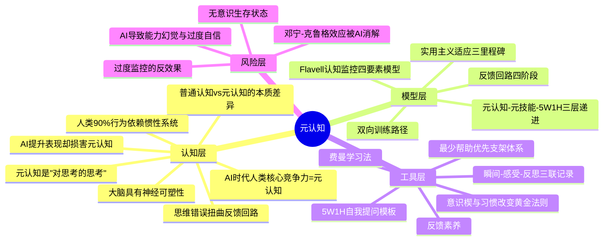

# 元认知 知识萃取报告

> 数据来源：每日镜鉴-运营总库（10篇文档）
> 萃取时间：2026-05-28

---

## 一、知识体系全景

**简要说明**：知识库中关于元认知的内容，呈现出从**底层认知洞察**→**系统模型框架**→**落地工具方法**→**风险警示**的四层结构。认知层揭示了"什么是元认知、为何重要"；模型层给出了"元认知如何运作"的系统性框架；工具层回答了"怎么练、怎么用"；风险层则警示"练不好、用偏了会怎样"。

---

## 二、方法论体系重塑

### 第一性原理

**认知系统只有在"自我参照"时才能突破惯性、实现升级。**

人类90%的日常行为依赖惯性系统运转【出处：《记录疗法》】，大脑的默认模式是"自动驾驶"——高效但盲目。元认知之所以是人类最高级别的认知能力，恰恰因为它打破了这层惯性：它让"自己"跳出自身，以旁观者视角审视"自己的思考过程"【出处：《元认知：改变大脑的顽固思维》】，形成"循环双向"（自己→思考过程→另一个自己）而非"线性单向"（自己→事物）的认知结构【出处：《记录疗法》】。这种自我参照不是奢侈的哲学思辨，而是认知突破的**必要条件**——没有它，思维永远在既定轨道上循环。

### 三大核心支柱

#### 支柱一：觉察分离——"看见"才能改变

元认知的起点是**心理分离**：从当前情境中抽离，以旁观者视角审视自身思维过程【出处：《元认知：改变大脑的顽固思维》】。这种能力不是默认拥有的——实验证明，年幼儿童就缺乏这种分离能力：他们常常高估自己的记忆准备程度，无法察觉指令中的遗漏和模糊【出处：《元认知》】。

觉察分离的神经基础在前额叶皮层，无意识模块的信息可进入"心理剧场"（意识空间）被有意识加工，进而反向调节系统状态【出处：《元认知：改变大脑的顽固思维》】。正如优秀记者需"行动迅速、来源可靠、提问准确、持续追踪、报道真实"，元认知觉察也需要快速分离评估情境、依托可靠知识、直击问题本质、持续追踪思维过程、坦诚面对自身真实想法【同上】。

**觉察分离的关键矛盾**：AI时代，这种分离能力正在被削弱。研究显示，使用AI后用户显著高估自身能力（平均高估约4分），元认知敏感性仅略高于随机水平（AUC=0.62），且对AI越熟悉者过度自信越严重【出处：《AI让你更聪明，但没有让你更有智慧》】。AI流畅的回应触发了"加工流畅性启发式"，让用户放松警惕、减少深入检查，形成**能力幻觉**【同上】。

#### 支柱二：反馈回路——"校准"才能纠偏

觉察之后是校准。弗拉维尔的认知监控模型揭示了元认知的四要素动态交互：元认知知识→元认知体验→目标→行动，循环往复【出处：《元认知》】。这一模型的本质就是一套**反馈回路系统**：

- **事实阶段**：搜集自身或外部信息
- **联系阶段**：将数据与自身需求关联，赋予意义
- **结果阶段**：判断方向，明确"做"或"不做"
- **行动阶段**：落实决策，行动结果作为新事实进入下一轮【出处：《元认知：改变大脑的顽固思维》】

反馈回路的关键敌人是**思维错误**（非黑即白、以偏概全、主观臆测等），它们会扭曲事实加工，导致回路偏移【同上】。而元认知策略的核心功能正是识别并修正这些偏移——它分为**认知策略**（直接推进认知目标，如重读课本）和**元认知策略**（监控认知进程，如自测评估理解程度）【出处：《元认知》】。

**反馈回路的深层价值**：反馈素养不仅是个体能力，更是系统健康的基石。正反馈放大趋势、推动探索，负反馈纠偏、维持平衡【出处：《AI时代人类元技能的探讨》】。一个系统（家庭、组织、社区）能否被温和而有效地纠正，决定了它会不会越跑越偏【同上】。

#### 支柱三：递进落地——"结构化"才能持续

觉察和校准若停留于"灵光一闪"，无法形成持久改变。知识库中反复出现一个三层递进体系：**元认知（看见）→ 元技能（做到）→ 5W1H（落地抓手）**【出处：《元认知元技能5W1H整合报告》】【出处：《关于元技能、元认知与5W1H的关联性报告》】。

- **元认知**是"大脑操作系统"，监控和调控整个认知过程
- **元技能**是"系统内置的高效应用程序"（番茄工作法、费曼学习法等），将抽象的元认知转化为可重复的行为模式
- **5W1H**是"通用操作界面"，为元认知的自我提问提供模板，为元技能的执行提供框架【同上】

这套体系的关键特征是**双向可通**：既可以从上到下由元认知驱动落地（适合有觉察基础的学习者），也可以从下到上通过5W1H训练反哺元认知（适合零基础从低门槛行动开始的学习者）【出处：《元认知元技能5W1H整合报告》】。

### 支柱间的动态关系

三大支柱形成**锁扣式递进**：

- **觉察分离**是起点——没有"看见"，一切都无从谈起。但它只是必要条件，不是充分条件。
- **反馈回路**是引擎——将"看见"转化为"校准"，让觉察产生实际效应。但若没有结构化支撑，校准容易半途而废。
- **递进落地**是轨道——将"校准"固化为可持续的行为模式，同时通过持续练习反向强化觉察能力和反馈精度。

三者缺一，体系失衡：有觉察无反馈则沦为空想，有反馈无落地则流于碎片，有落地无觉察则陷入机械。

---

## 三、核心观点溯源

### 认知层观点溯源

| 提炼观点 | 原文溯源 | 出处 |
|----------|----------|------|
| 元认知是"对思考的思考"，人类独有的从当前情境中"心理分离"、以旁观者视角审视自身思维过程的能力 | "元认知即'对思维的思考'，是人类独有的从当前情境中'心理分离'、以旁观者视角审视自身思维过程的能力，是改变反馈回路最强大的内部力量" | 《元认知：改变大脑的顽固思维》 |
| 普通认知与元认知的本质差异：线性单向 vs 循环双向 | 普通认知"直接指向外部事物"，元认知"指向自身的思考过程"；普通认知"线性单向（自己→事物）"，元认知"循环双向（自己→思考过程→另一个自己）" | 《记录疗法》 |
| 人类90%行为依赖惯性系统 | "心理学实验证明：人类日常行为90%依赖惯性系统（《思考，快与慢》理论）" | 《记录疗法》 |
| AI提升表现却损害元认知，导致能力幻觉 | "AI组参与者实际平均答对12.98-13.31道，但预估自己答对16.50道左右，平均高估约4分"；"AI流畅、自信的回应会触发'加工流畅性启发式'，让用户放松警惕" | 《AI让你更聪明，但没有让你更有智慧》 |
| AI时代人类核心竞争力是元认知能力 | "答案是元认知能力——即对自身认知过程的觉察、建模与优化能力" | 《慧惠金典语录》 |
| 思维错误扭曲反馈回路 | "思维错误（如非黑即白、以偏概全、主观臆测等）会扭曲事实加工，导致反馈回路偏移" | 《元认知：改变大脑的顽固思维》 |
| 大脑具有神经可塑性，人格并非固定 | "大脑具备神经可塑性，突触的形态、大小可随经验、训练发生变化"；"'大五人格'的得分可在环境作用下发生改变" | 《元认知：改变大脑的顽固思维》 |

### 模型层观点溯源

| 提炼观点 | 原文溯源 | 出处 |
|----------|----------|------|
| 认知监控四要素：元认知知识+元认知体验+目标+行动 | "对认知活动的监控是通过四类现象的相互作用实现的：元认知知识、元认知体验、目标（或任务）、行动（或策略）" | 《元认知》/《Metacognition_and_Cognitive_Monitoring_A.pdf》 |
| 反馈回路四阶段：事实→联系→结果→行动 | "反馈回路包含四个环环相扣的阶段：事实阶段、联系阶段、结果阶段、行动阶段" | 《元认知：改变大脑的顽固思维》 |
| 元认知-元技能-5W1H三层递进体系 | "元认知=看见，元技能=做到，5W1H=落地的操作抓手" | 《元认知元技能5W1H整合报告》 |
| 双向训练路径 | "既可以从上到下由元认知驱动落地，也可以从下到上通过工具训练反哺能力提升，双向路径都能强化整体认知能力" | 《元认知元技能5W1H整合报告》 |
| 实用主义适应三里程碑：自律型人格、自我对称、有意识自我叙述 | "通过元认知训练可达到三种适应状态：1.自律型人格…2.自我对称…3.有意识自我叙述" | 《元认知：改变大脑的顽固思维》 |
| "最少帮助优先"的支架体系 | "遵循'最少帮助优先'的原则；仅在必要时进行提示、线索引导、示范或纠正，以引导学生走向自主支架" | 《促进学生使用元认知策略的框架》 |

### 工具层观点溯源

| 提炼观点 | 原文溯源 | 出处 |
|----------|----------|------|
| 意识楔：行动前暂停评估 | "使用'意识楔'（行动前暂停评估）" | 《元认知：改变大脑的顽固思维》 |
| 习惯改变黄金法则：不换线索和收益，只换行为 | "遵循'习惯改变黄金法则'，不改变习惯的线索和收益，仅替换中间的行为程序" | 《元认知：改变大脑的顽固思维》 |
| 5W1H是元认知的自我提问模板 | "5W1H是元认知的自我提问模板：当进行元认知监控时，可以借助5W1H的六个问题引导思考" | 《元认知元技能5W1H整合报告》 |
| "瞬间-感受-反思"三联记录 | "建立'瞬间-感受-反思'三联记录" | 《记录疗法》 |
| 反馈素养：正反馈放大趋势，负反馈纠偏 | "正反馈放大趋势，推动创意、探索和试错；负反馈纠偏，提醒我们轨道偏了、参数该调了" | 《AI时代人类元技能的探讨》 |
| 记录疗法的蜕变路径 | "记录→觉察→接纳→改变，形成正向循环。当记录积累到临界点（约3个月），将发生：情绪颗粒度细化300%，关系敏感度提升170%，决策理性度增加200%" | 《记录疗法》 |

---

## 四、实战行动指南

### 场景一：每天刷手机/用AI后感觉"很忙但什么都没记住"

**最小可行性动作**：今天睡前花5分钟，写下"今天哪3个瞬间让我有感觉？那个感觉是什么？我现在怎么看？"

**应用要点**：
1. 三联记录（瞬间→感受→反思）是启动元认知觉察的最低成本入口【出处：《记录疗法》】
2. 不追求文采，只追求"看得见"自己的思考和行为模式
3. 持续3个月积累后，元认知觉察能力会发生实质性提升【同上】

**潜在翻车点**：
- ⚠️ 追求"完美记录"反而放弃 → 应对：降低标准，哪怕只写一句话也算完成
- ⚠️ 记录流于表面事件罗列 → 应对：聚焦"内在感知"而非"外在展示"，捕捉微观情绪

### 场景二：做重要决策时容易"脑热"冲上去

**最小可行性动作**：下一个需要拍板的决策前，插入一个"意识楔"——暂停3秒，问自己："我现在在用什么模式思考？是惯性反应还是理性分析？"

**应用要点**：
1. 意识楔是元认知觉察的最小单元，行动前暂停评估就能打断自动加工【出处：《元认知：改变大脑的顽固思维》】
2. 配合5W1H自我提问：我这个决策的目标是什么（What）？为什么选它（Why）？涉及谁（Who）？时间节点合理吗（When）？有场景限制吗（Where）？执行步骤可行吗（How）？【出处：《元认知元技能5W1H整合报告》】
3. 检查是否存在思维错误（非黑即白、以偏概全等）扭曲了你的判断【出处：《元认知：改变大脑的顽固思维》】

**潜在翻车点**：
- ⚠️ 暂停后反而不敢决策 → 应对：意识楔是"评估"不是"拖延"，设一个30秒时限，到时就动
- ⚠️ 5W1H问不全就焦虑 → 应对：不需要每次六要素齐备，关键是在心里过一遍排查盲区

### 场景三：用AI辅助工作后，不确定自己到底会不会

**最小可行性动作**：下次用AI生成结果后，不直接复制使用，先花2分钟用自己的话复述AI的推理逻辑，标注"我理解的"vs"AI说的"。

**应用要点**：
1. 复述AI逻辑是打破"直接复制粘贴依赖"的有效手段，能降低知识错觉和过度自信【出处：《AI让你更聪明，但没有让你更有智慧》】
2. 明确AI的能力边界：研究显示58.94%的参与者对AI高度信任，平均每题仅交互1.15次，属于浅交互【同上】
3. 主动校准自我认知：关注"我实际能做到什么"而非"AI帮我做到了什么"

**潜在翻车点**：
- ⚠️ 过度怀疑AI结果导致效率骤降 → 应对：区分"关键决策场景"（必须校准）和"日常辅助场景"（可以信任）
- ⚠️ 校准后仍然高估自己 → 应对：引入外部反馈——让别人检验你的理解，不只是在脑子里自检

### 场景四：想改掉某个顽固习惯但反复失败

**最小可行性动作**：选一个想改的习惯，识别它的"线索→行为→收益"链条，今天只做一件事：设计一个替代行为，保持同样的线索和收益，只换中间的行为程序。

**应用要点**：
1. 遵循"习惯改变黄金法则"：不改变习惯的线索和收益，仅替换中间的行为程序【出处：《元认知：改变大脑的顽固思维》】
2. 例：用喝咖啡替代吸烟缓解紧张——线索（紧张）不变，收益（缓解）不变，只换行为
3. 大脑的神经可塑性支撑这一改变：突触可随经验、训练发生变化【同上】

**潜在翻车点**：
- ⚠️ 替代行为无法提供同等收益 → 应对：先观察旧习惯真正提供的是什么情绪价值，再匹配替代
- ⚠️ 过度监控导致焦虑 → 应对：世界上的认知监控"总体严重不足而非过度"【出处：《元认知》】，但对自己也要遵循"最少帮助优先"——只在需要时介入，避免变成自我审判
