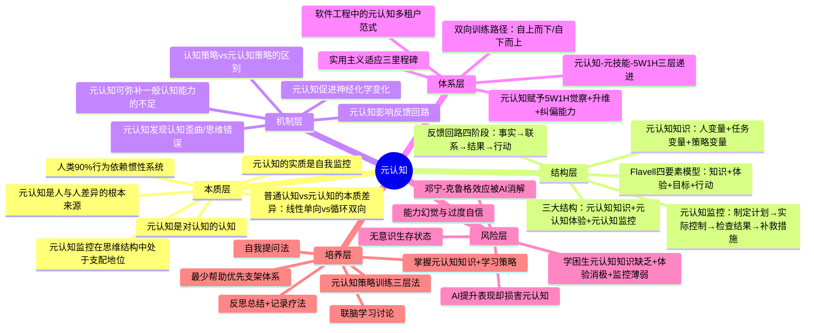

# 元认知 知识萃取报告（全知识库版）

> 数据来源：所有知识库 + 笔记（18篇文档，跨越4个知识库）
> 萃取时间：2026-06-02

---

## 一、知识体系全景

**简要说明**：与上次仅从单一知识库萃取相比，全知识库版新增了**结构层**（元认知三大/四要素模型的完整拆解）、**机制层**（元认知如何弥补认知能力不足、认知策略vs元认知策略的区别）、**体系层**（元认知在软件工程中的范式迁移）、**风险层**（学困生的元认知缺陷特征）、**培养层**（训练三层法、联脑讨论、自我提问法等系统培养方法）。认知维度从4层扩展为7层，体系更加丰满。

---

## 二、方法论体系重塑

### 第一性原理

**认知系统只有在"自我参照"时才能突破惯性、实现升级。**

这一原理贯穿所有知识库文档，从多个层面得到印证：

人类90%的日常行为依赖惯性系统运转【出处：《记录疗法》】，大脑的默认模式是"自动驾驶"——高效但盲目。元认知让"自己"跳出自身，以旁观者视角审视"自己的思考过程"【出处：《元认知：改变大脑的顽固思维》】，形成"循环双向"而非"线性单向"的认知结构【出处：《记录疗法》】。当代心理学理论进一步证实：人的思维结构中，监控系统（元认知）处于支配地位，对目标系统、材料系统、操作系统、产品系统起着控制协调作用【出处：《问题解决中的元认知研究综述》】。这种自我参照不是哲学思辨，而是**认知突破的必要条件**——没有它，思维永远在既定轨道上循环。

更关键的是，Swanson的实验证明：**元认知能力高而一般认知能力差的人，比元认知能力差而一般认知能力高的人解决问题效果更好**【出处：《问题解决中的元认知研究综述》】。这意味着元认知能够弥补一般认知能力的不足——"自我参照"不只是锦上添花，而是**可以补短板的底层能力**。

### 四大核心支柱

#### 支柱一：觉察分离——"看见"才能改变

元认知的起点是**心理分离**：从当前情境中抽离，以旁观者视角审视自身思维过程【出处：《元认知：改变大脑的顽固思维》】。这种能力不是默认拥有的——年幼儿童就缺乏这种分离能力，常常高估自己的记忆准备程度，无法察觉指令中的遗漏和模糊【出处：《元认知》】。学困生的表现更为典型：他们对作为学习者的自我缺乏清晰认识，不了解自己的学习风格和擅长的学习方法，对学习能力也缺乏正确评价【出处：《学困生的元认知特征分析及教育干预》】。

觉察分离的通俗理解是："一个干活的，一个是监工的，只不过是自己监督自己。比如一个人如果老是问自己：我为什么又有这样的想法？我的想法正确吗？如果不正确如何调整？这就是元认知，别看这么简单的问题，但很难做到，人和人的区别莫过于此。"【出处：《13元认知｜认知背后的认知》】

**觉察分离的深层矛盾**：AI时代，这种分离能力正在被削弱。使用AI后用户显著高估自身能力（平均高估约4分），元认知敏感性仅略高于随机水平（AUC=0.62），且对AI越熟悉者过度自信越严重【出处：《AI让你更聪明，但没有让你更有智慧》】。AI流畅的回应触发了"加工流畅性启发式"，让用户放松警惕，形成**能力幻觉**【同上】。

#### 支柱二：反馈回路——"校准"才能纠偏

觉察之后是校准。弗拉维尔的认知监控模型揭示了元认知四要素的动态交互：元认知知识→元认知体验→目标→行动，循环往复【出处：《元认知》】。这一模型的本质是一套**反馈回路系统**，包含事实→联系→结果→行动四个环环相扣的阶段【出处：《元认知：改变大脑的顽固思维》】【出处：《13元认知｜认知背后的认知》】。

反馈回路的关键敌人是**认知歪曲/思维错误**——非黑即白、以偏概全、主观臆测等会扭曲事实加工，导致回路偏移【出处：《元认知：改变大脑的顽固思维》】。而元认知策略的核心功能正是识别并修正这些偏移。

**认知策略与元认知策略的关键区分**：认知策略直接加工信息（如重读课本），元认知策略控制、监视和指导信息加工过程（如自测评估理解程度）【出处：《元认知与学习策略》】。前者具有特定性，需根据不同学习任务选择对应策略；后者更具一般性，独立于具体学习内容，可广泛作用于各类学习任务【同上】。

**反馈回路的系统价值**：反馈素养不仅是个体能力，更是系统健康的基石。正反馈放大趋势、推动探索，负反馈纠偏、维持平衡【出处：《AI时代人类元技能的探讨》】。一个系统（家庭、组织、社区）能否被温和而有效地纠正，决定了它会不会越跑越偏【同上】。

#### 支柱三：递进落地——"结构化"才能持续

觉察和校准若停留于"灵光一闪"，无法形成持久改变。知识库中反复出现一个三层递进体系：**元认知（看见）→ 元技能（做到）→ 5W1H（落地抓手）**【出处：《元认知元技能5W1H整合报告》】【出处：《关于元技能、元认知与5W1H的关联性报告》】。

- **元认知**是"大脑操作系统"，监控和调控整个认知过程
- **元技能**是"系统内置的高效应用程序"（番茄工作法、费曼学习法等），将抽象的元认知转化为可重复的行为模式
- **5W1H**是"通用操作界面"，为元认知的自我提问提供模板，为元技能的执行提供框架【同上】

元认知对5W1H的作用可从三个维度理解：**觉察**（识别当前使用的维度、填补盲区、避免"机械填空"）、**升维**（推动递归追问、抽象成模型、形成认知网络）、**纠偏**（监控提问效果、调节方式、嵌入反馈回路）【出处：《元认知与5W1H》】。

这套体系的关键特征是**双向可通**：既可以从上到下由元认知驱动落地，也可以从下到上通过5W1H训练反哺元认知【出处：《元认知元技能5W1H整合报告》】。

#### 支柱四：系统迁移——"元认知"可跨界升维

这是全知识库版新增的核心支柱。元认知不仅是个人层面的认知能力，更可以迁移到组织系统、软件工程、教育体系等更广阔的领域：

**组织层面**：在AI时代的软件工程中，出现了从"元数据多租户"到"元认知多租户"再到"AI原生系统"的三级跃迁——元认知多租户阶段的系统"监测运行状态，主动调适"，工程师的角色从"配置定义者"转变为"反馈回路设计者"【出处：《基于AI原生、智能体优先的软件工程新范式》】。个人思维体系的建模，本质上是一次"对元认知的元认知"——不仅觉察自己的思维过程，更将其抽象为可复用的结构【出处：《慧惠金典语录》】。

**教育层面**：元认知训练的效果可跨学科迁移。研究表明，以元认知教学方式训练的历史系学生，虽然开始进步慢，但到学习结束时比传统教学组更多使用深层学习方式，作业完成得更好【出处：《问题解决中的元认知研究综述》】。元认知训练对复杂困难问题的效果尤其明显——在最难问题上，接受元认知训练的组成绩显著优于仅接受策略训练的组【同上】。

**个体层面**：元认知能力可以弥补一般认知能力的不足。Swanson的研究发现，高元认知能力低一般认知能力组的表现优于低元认知能力高一般认知能力组【出处：《问题解决中的元认知研究综述》】——斯腾伯格的智力新模式也将元认知成分纳入其中，认为其"在整个智力活动中处于支配地位"【同上】。

### 支柱间的动态关系

四大支柱形成**螺旋递进+横向迁移**的动态结构：

- **觉察分离**是起点——没有"看见"，一切都无从谈起
- **反馈回路**是引擎——将"看见"转化为"校准"，让觉察产生实际效应
- **递进落地**是轨道——将"校准"固化为可持续的行为模式
- **系统迁移**是升维——将个人层面的"觉察-校准-落地"能力扩展到组织、教育、工程等更大系统

前三者形成纵向锁扣（觉察→反馈→落地），第四者实现横向跃迁（个人→系统）。纵向是基础，横向是升华——当个人的元认知能力足够成熟时，它会自然地外溢为组织级的能力：正如软件工程中"个体的思维方法论，在AI时代必须上升为组织级的可编码约束"【出处：《慧惠金典语录》】。

---

## 三、核心观点溯源

### 本质层观点溯源

| 提炼观点 | 原文溯源 | 出处 |
|----------|----------|------|
| 元认知是"对认知的认知"，由弗拉维尔1976年提出 | "他将元认知表述为'个人关于自己的认知过程及结果或其它相关事情的知识'，以及'为完成某一具体目标或任务，依据认知对象对认知过程进行主动的监测以及连续的调节和协调'" | 《13元认知｜认知背后的认知》 |
| 元认知的实质是自我监控 | "元认知的实质是人的自我监控。元认知的作用是从深层次提高学习能力和从根本上提高学习效果" | 《13元认知｜认知背后的认知》 |
| 元认知是人与人差异的根本来源 | "人和人的区别莫过于此"（指元认知的自我监控能力差异） | 《13元认知｜认知背后的认知》 |
| 普通认知与元认知的本质差异 | "通俗的讲就是一个干活的，一个是监工的，只不过是自己监督自己" | 《13元认知｜认知背后的认知》 |
| 元认知监控在思维结构中处于支配地位 | "思维结构的各要素中，监控系统（元认知）起着整体控制、协调的作用。它的发展水平直接制约着其它方面的发展，同时也集中地反映了一个人思维、智力水平的高低" | 《问题解决中的元认知研究综述》 |
| 元认知可弥补一般认知能力的不足 | "高元认知能力组解决问题的表现比低元认知能力组好，尤其值得注意的是，元认知能力高而一般认知能力差的组比元认知能力差而一般认知能力高的组解决问题效果更好" | 《问题解决中的元认知研究综述》 |
| 人类90%行为依赖惯性系统 | "心理学实验证明：人类日常行为90%依赖惯性系统（《思考，快与慢》理论）" | 《记录疗法》 |

### 结构层观点溯源

| 提炼观点 | 原文溯源 | 出处 |
|----------|----------|------|
| 元认知三结构：知识+体验+监控 | "元认知由元认知知识、元认知体验、元认知监控三方面内容构成" | 《学困生的元认知特征分析及教育干预》 |
| Flavell四要素模型 | "对认知活动的监控是通过四类现象的相互作用实现的：元认知知识、元认知体验、目标（或任务）、行动（或策略）" | 《元认知》/《Metacognition_and_Cognitive_Monitoring_A.pdf》 |
| 元认知知识三类变量：人+任务+策略 | "人变量：关于认知者自身及他人的信念…任务变量：关于认知任务性质的知识…策略变量：关于何种策略在何种认知活动中对达成何种目标有效" | 《元认知》 |
| 元认知监控四环节 | "制定计划→实际控制→检查结果→补救措施" | 《13元认知｜认知背后的认知》 |
| 反馈回路四阶段 | "事实阶段→联系阶段→结果阶段→行动阶段" | 《元认知：改变大脑的顽固思维》/《13元认知｜认知背后的认知》 |

### 机制层观点溯源

| 提炼观点 | 原文溯源 | 出处 |
|----------|----------|------|
| 元认知影响反馈回路 | "如果医生有强大的元认知能力，时刻对自己的搜集信息、筛选信息、处理信息、做出行动进行元认知监控…在元认知能力的帮助下就可以影响反馈回路，形成正反馈" | 《13元认知｜认知背后的认知》 |
| 元认知发现认知歪曲 | "如果你拥有强大的元认知能力，通过提问和自我验证，就可以发现自己的认知歪曲，进行认知重建" | 《13元认知｜认知背后的认知》 |
| 元认知促进神经化学变化 | "元认知可以帮我们建立良性的神经回路系统" | 《13元认知｜认知背后的认知》 |
| 认知策略vs元认知策略 | "认知策略具有特定性，需根据不同学习任务选择对应策略；元认知策略更具一般性，独立于具体学习内容，可广泛作用于各类学习任务，负责对认知过程进行自我反省、自我监控与自我调节" | 《元认知与学习策略》 |

### 体系层与培养层观点溯源

| 提炼观点 | 原文溯源 | 出处 |
|----------|----------|------|
| 元认知-元技能-5W1H三层递进 | "元认知=看见，元技能=做到，5W1H=落地的操作抓手" | 《元认知元技能5W1H整合报告》 |
| 元认知赋予5W1H觉察+升维+纠偏 | "元认知是5W1H的'大脑'和'交警'——它让我们不仅会问'5W1H'，还能知道为什么这样问、问得对不对、如何问得更好" | 《元认知与5W1H》 |
| 软件工程中的元认知范式迁移 | "元认知多租户：监测运行状态，主动调适。工程师角色：反馈回路设计者" | 《基于AI原生、智能体优先的软件工程新范式》 |
| 个人思维建模是"对元认知的元认知" | "个人思维体系的建模，本质上是一次'对元认知的元认知'——不仅觉察自己的思维过程，更将其抽象为可复用的结构" | 《慧惠金典语录》 |
| 元认知训练三层法 | "盲目训练法→感受训练法→感受-自控训练法，效果依次提升" | 《元认知与学习策略》 |
| 学困生元认知三特征 | "元认知知识相对缺乏、元认知体验相对消极、元认知监控技能相对薄弱" | 《学困生的元认知特征分析及教育干预》 |
| 元认知训练可跨学科迁移 | "元认知教学组开始进步慢，但到学习结束时比传统教学组更多深层学习方式，作业完成得更好" | 《问题解决中的元认知研究综述》 |
| 元认知训练对复杂问题效果最明显 | "在最难的题目上，第一组（元认知训练组）的成绩显著地优于第二组（策略训练组）" | 《问题解决中的元认知研究综述》 |
| 最少帮助优先支架体系 | "遵循'最少帮助优先'的原则；仅在必要时进行提示、线索引导、示范或纠正" | 《促进学生使用元认知策略的框架》 |
| 记录疗法的蜕变路径 | "记录→觉察→接纳→改变…3个月后：情绪颗粒度细化300%，关系敏感度提升170%，决策理性度增加200%" | 《记录疗法》 |
| 外语学习中元认知策略的应用 | "成功的外语学习者元认知水平更高，能灵活使用元认知策略监控学习过程、调整策略" | 《元认知与外语学习研究》 |
| 自主学习的关键是元认知 | "元认知监控是元认知学习能力的核心，伴随自主学习过程始终，是自主学习的关键" | 《自主学习的关键——元认知、元认知策略及其培养》 |

---

## 四、实战行动指南

### 场景一：学习新领域知识时"看了忘、学了丢"

**最小可行性动作**：今天学完一个知识点后，不急着往下走，花3分钟做三件事：①我刚才学了什么？用自己的话说一遍；②我真的理解了吗？找出一个可能的误解点；③下次我怎么学得更好？记一条策略调整。

**应用要点**：
1. 元认知监控的四环节：制定计划→实际控制→检查结果→补救措施【出处：《13元认知｜认知背后的认知》】
2. 自我提问法：在学习过程中随时问"我原来是怎么做的？我真的理解了吗？我理解有没有偏差？"【同上】
3. 元认知策略训练三层法：从"知道是什么"（盲目训练），到"知道为什么"（感受训练），再到"能自主运用"（感受-自控训练），效果依次提升【出处：《元认知与学习策略》】

**潜在翻车点**：
- ⚠️ 只做表面复习（重读/勾画），不做元认知监控 → 应对：每次复习后强制自测，用"费曼法"复述，不自测不算学完
- ⚠️ 计划过细导致执行瘫痪 → 应对：计划只需明确"学什么+怎么判断学会"，不必面面俱到

### 场景二：做复杂决策/解决难题时容易"钻进去出不来"

**最小可行性动作**：下一个难题卡住时，插入"意识楔"——暂停，问自己："我现在的思路方向对吗？有没有别的路径？我是否被思维错误（非黑即白/以偏概全）绑架了？"

**应用要点**：
1. 意识楔是元认知觉察的最小单元，行动前暂停评估就能打断自动加工【出处：《元认知：改变大脑的顽固思维》】
2. 元认知训练对复杂问题效果最明显：实验证明，在最难问题上，元认知训练组的成绩显著优于仅接受策略训练的组【出处：《问题解决中的元认知研究综述》】
3. 配合5W1H自我提问，快速暴露自动化思考的盲区【出处：《元认知元技能5W1H整合报告》】

**潜在翻车点**：
- ⚠️ 暂停后反而陷入"分析瘫痪" → 应对：设30秒时限，到时就按当前最佳判断行动
- ⚠️ 元认知监控变成"自我怀疑循环" → 应对：监控不是怀疑一切，而是"评估→决定→行动→再评估"的闭环

### 场景三：带团队/教别人时，对方"学了不会用"

**最小可行性动作**：下次教人时，不直接给答案，而是问三个问题：①"你觉得这个任务最难的地方在哪？"②"你打算怎么开始？"③"做完了你怎么判断自己做得对不对？"——把元认知监控的主动权交给对方。

**应用要点**：
1. "最少帮助优先"原则：自主支架→提示→线索引导→示范→纠正，只在必要时介入【出处：《促进学生使用元认知策略的框架》】
2. 教师展现思维过程：用语言展示自己解决问题的策略选择和调整过程（"首选策略是什么，补救策略是什么"）【出处：《元认知与学习策略》】
3. 学困生的核心问题不是能力差，而是元认知知识缺乏+体验消极+监控薄弱——干预要从"丰富知识→增强体验→提高监控"三步走【出处：《学困生的元认知特征分析及教育干预》】

**潜在翻车点**：
- ⚠️ 过早示范/纠正，剥夺对方元认知训练机会 → 应对：遵循"最少帮助优先"，先等5秒让对方自己想
- ⚠️ 只教策略不教"什么时候用" → 应对：条件性知识（何时做、什么场景、为什么这样做）比程序性知识更重要

### 场景四：用AI辅助工作后不确定自己到底会不会

**最小可行性动作**：下次用AI生成结果后，不直接复制使用，先花2分钟用自己的话复述AI的推理逻辑，标注"我理解的"vs"AI说的"。

**应用要点**：
1. 复述AI逻辑是打破"直接复制粘贴依赖"的有效手段【出处：《AI让你更聪明，但没有让你更有智慧》】
2. 明确AI的能力边界：58.94%的参与者对AI高度信任，平均每题仅交互1.15次，属于浅交互【同上】
3. 在软件工程领域，人类角色已从"代码编写者"迁移为"约束定义者+反馈回路构建者"——元认知从个人能力上升为组织级"可编码约束"【出处：《基于AI原生、智能体优先的软件工程新范式》】【出处：《慧惠金典语录》】

**潜在翻车点**：
- ⚠️ 过度怀疑AI结果导致效率骤降 → 应对：区分"关键决策场景"（必须校准）和"日常辅助场景"（可以信任）
- ⚠️ 校准后仍高估自己 → 应对：引入外部反馈——让别人检验你的理解

### 场景五：想培养自己的元认知能力但不知从何入手

**最小可行性动作**：今天睡前做"瞬间-感受-反思"三联记录：哪3个瞬间让我有感觉？那个感觉是什么？我现在怎么看？5分钟写完，不追求文采。

**应用要点**：
1. 三联记录是启动元认知觉察的最低成本入口【出处：《记录疗法》】
2. 持续3个月积累后，元认知觉察能力会发生实质性提升【同上】
3. 双向训练路径可选：
   - **自上而下**（有觉察基础）：知识学习→反思记录→凝神呼吸→元技能训练→5W1H落地【出处：《元认知元技能5W1H整合报告》】
   - **自下而上**（零基础起步）：5W1H拆解→元技能刻意练习→三联记录触发元认知【同上】
4. 联脑学习讨论：和他人进行思维互动，针对核心问题进行思辨，可让自己理解和记忆更深刻【出处：《13元认知｜认知背后的认知》】
5. 打坐冥想：放空自己，思考一天的收获和问题，进行认知重建【同上】

**潜在翻车点**：
- ⚠️ 追求"完美记录"反而放弃 → 应对：哪怕只写一句话也算完成
- ⚠️ 记录流于表面事件罗列 → 应对：聚焦"内在感知"而非"外在展示"
- ⚠️ 过度监控导致焦虑 → 应对：世界上的认知监控"总体严重不足而非过度"，但对自己也要遵循"最少帮助优先"——只在需要时介入
