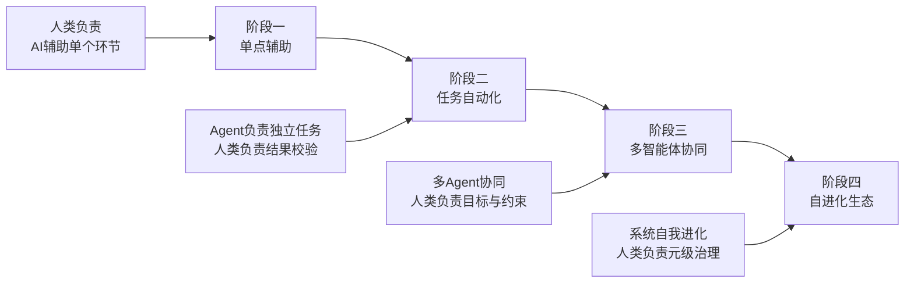

基于我们构建的完整知识体系，我对“无App生态与云端一体化智能体”的实践前沿进行了系统性调研。以下报告将从案例深度剖析、落地路线图与行动指南三个层次展开，力求为技术决策者与执行团队提供一份可操作的参考。

---

# 从概念到落地：无App生态与云端一体化智能体实践指南

**报告日期**：2026年6月4日

## 一、启灶反问

**【反问】** ：当我们将Agent视为“数字劳动力”时，是否已为其准备好了完整的“入职流程”——包括身份工牌（Agent Identity）、操作手册（Skill/规约）、工位（运行环境）和绩效看板（Observability）？

## 二、前沿案例调研：三种落地模式的实践探索

当前业界“无App生态”与“云端一体化智能体”的落地实践，可归纳为三种主要模式，各有其成熟度与适用场景。

### 模式一：操作系统级Agent——“超级入口”模式

**代表案例**：
- **OpenAI Device端Agent演示**（我们刚解析的视频）：用户通过自然语言下达任务，Agent跨越相册、邮件、地图等原生应用完成任务，桌面本身成为动态服务流。
- **Apple Intelligence + App Intents**：苹果通过App Intents框架，让开发者将App的核心功能暴露给Siri，实现跨应用的意图调度。
- **Google Workspace Intelligence**：在Google生态内，用户在Chat中收到通知后，Agent可直接调取Drive中的文档、HubSpot的盈亏数据，自动生成Slides汇报材料【附件Google Cloud Next 26解读】。

**落地路径**：
1.  **定义意图域（Intent Domain）**：梳理用户最高频的跨应用任务（如“分享会议纪要并安排后续日程”）。
2.  **开放能力接口**：开发者通过类似Apple App Intents或Google A2UI/MCP协议的标准化方式，将核心功能封装为Agent可调用的工具。
3.  **构建调度中枢**：云端或端侧的智能体平台作为“总控”，接收用户意图后规划步骤、调用工具、组装结果。

**关键启示**：此模式需要平台级厂商的生态推动力，但对中小企业而言，可聚焦于**在自己的应用矩阵内实现跨服务协同**。

### 模式二：平台级Agent Store——“数字劳动力市场”模式

**代表案例**：
- **Google Agentic Taskforce**：Google在Cloud Next 26上展示的“数字特遣队”，涵盖客户服务、数据分析、代码审查等专用Agent，企业可按需采购和编排【附件Google Cloud Next 26解读】。
- **Salesforce Agentforce**：Salesforce在其生态内构建的Agent市场，第三方开发者可发布面向特定业务场景的Agent，企业客户可直接部署。
- **ChatGPT GPTs / Plugin生态**：虽然尚不成熟，但已展示了Agent分发的早期形态。

**落地路径**：
1.  **定义Agent的职责边界**：每个Agent需明确其可执行的任务集、所需的权限范围、以及输入/输出契约。
2.  **建立信用与质量评估机制**：如我们讨论的Skill自进化中的“信用分配”问题【Skill自进化综述】，Agent市场需要类似的评分与审核体系。
3.  **构建编排层**：企业需要一个“Agent Orchestrator”来调度多个Agent协同完成复杂任务。

**关键启示**：此模式适合有平台基础的企业。对于一般企业，更务实的做法是**内部建立Agent能力池**，而非直接构建外部市场。

### 模式三：自进化Agent Swarm——“群体智能”模式

**代表案例**：
- **OpenAI Codex团队实践**：我们附件中详细解读的“零人工编码”项目，本质上是多个Codex智能体（编写、审查、测试、文档、安全）在人类定义的约束框架内协同工作【附件《工程技术：在智能体优先的世界中利用 Codex》】。
- **Google多智能体代码迁移**：Google CEO Sundar Pichai透露，他们用“规划、统筹、编码”三类Agent协同完成复杂代码迁移，速度提升6倍【附件Google Cloud Next 26解读】。
- **SkillClaw & CoEvoSkills**：我们讨论的Skill自进化研究，展示了多个Agent共享技能库、通过“群体共享+精英治理”实现能力进化的路径【Skill自进化综述】。

**落地路径**：
1.  **设定总目标与约束边界**：人类定义任务目标（如“将此模块从Java迁移至Kotlin”），设定架构约束（如“保持API兼容”、“代码风格符合规范”）。
2.  **编排多角色Agent**：部署“规划师Agent”、“工程师Agent”、“审查Agent”、“测试Agent”等，各司其职。
3.  **建立反馈与自进化闭环**：如OpenAI团队所做的，将错误模式、最佳实践持续沉淀为可复用的Skill和Harness约束【附件《工程技术：在智能体优先的世界中利用 Codex》】。

**关键启示**：此模式最接近我们讨论的“AI原生软件工程”理想，但其落地需要较高的工程成熟度。**建议从单一Agent + 严格Harness开始，逐步向多Agent协同演进。**

## 三、落地路线图：四阶段成熟度模型

基于上述案例与我们的理论体系，提出以下四阶段成熟度模型：

| 阶段 | 核心特征 | 关键建设任务 | 参考案例 |
| :--- | :--- | :--- | :--- |
| **一：单点辅助** | AI辅助代码生成、文档撰写等单点任务，人类全程主导 | 引入AI编码助手；建立基础代码规范 | GitHub Copilot基础应用 |
| **二：任务自动化** | Agent可独立完成一个完整任务（如生成CRUD模块），人类确认结果 | 构建Harness约束体系；建立SDD或BMAD开发流程；设计A2UI兼容的界面组件 | OpenAI Codex单Agent开发 |
| **三：多智能体协同** | 多个Agent分工协作完成复杂任务，人类定义目标与接口 | 构建Agent Orchestrator；建立Agent Identity与权限体系；实施Agent Observability | Google多智能体代码迁移 |
| **四：自进化生态** | 系统具备自我学习、自我修复能力，人类负责元级治理 | 建立Skill Bank与信用分配机制；完善文档园艺与代码垃圾回收智能体；构建跨云Lakehouse | 尚无完全成熟案例 |

### 阶段间跃迁的触发条件

| 跃迁路径 | 触发条件 | 风险警示 |
| :--- | :--- | :--- |
| **一→二** | Agent在单点任务上的可靠性超过人工平均水平 | 过早自动化会放大错误，确保Harness先于Agent部署 |
| **二→三** | 单个Agent的任务边界清晰、API稳定，可被编排 | 多Agent协同的故障排查复杂度呈指数级上升 |
| **三→四** | 积累了足够多的高质量Skill，信用分配机制验证有效 | 自进化可能导致系统行为不可预测，需保留人工熔断机制 |

## 四、行动指南：按角色的具体实施方案

### 对于技术决策者（CTO / VP of Engineering）

| 时间框架 | 行动项 | 产出物 |
| :--- | :--- | :--- |
| **1-3个月** | 组建Agent化转型小组，梳理内部所有可被Agent替代或增强的任务清单 | Agent机会地图 |
| **3-6个月** | 选择2-3个高频、边界清晰的任务，试点SDD开发流程 | 试点项目复盘报告 |
| **6-12个月** | 构建Agent Orchestrator原型，选定内部Agent开发平台 | 平台选型决策文档 |
| **12-24个月** | 建立组织级Agent Governance委员会，制定Agent开发、部署、监控全生命周期规范 | Agent治理白皮书 |

### 对于平台/基础设施团队

| 行动项 | 技术选型建议 | 优先级 |
| :--- | :--- | :--- |
| **Agent Runtime搭建** | 评估LangChain / AutoGen / CrewAI等框架；或直接采用云厂商的Agent平台 | 🔴 高 |
| **Harness体系构建** | 自定义Linter + 架构依赖检查 + 沙盒测试环境；参考OpenAI的“约束编码”策略 | 🔴 高 |
| **Agent Identity & Gateway** | 为每个Agent分配唯一加密ID；实施零信任访问策略；所有调用纳入审计 | 🟡 中 |
| **Cross-Cloud Lakehouse** | 基于Apache Iceberg打通多数据源；部署Knowledge Catalog自动标记非结构化数据 | 🟡 中 |
| **A2UI渲染引擎** | 调研Flutter/React对A2UI的适配方案；构建内部可复用组件库 | 🟢 低 |

### 对于产品与设计团队

| 行动项 | 具体实践 | 预期效果 |
| :--- | :--- | :--- |
| **从“界面设计”转向“意图设计”** | 用“用户想达成什么任务”替代“用户点击哪个按钮” | 与Agent开发语言对齐 |
| **建立交互原型新工具链** | 探索基于A2UI、Stitch等工具的低代码原型方式 | 快速验证Agent驱动场景 |
| **制定Agent交互设计规范** | 包括任务进度可见性、异常状态提示、人工介入入口等 | 保障用户体验一致性 |

### 对于一线开发者

| 行动项 | 技能方向 |
| :--- | :--- |
| **掌握“面向规约编程”** | 学习如何编写高质量的PRD、接口定义、测试用例，而非直接写实现代码 |
| **熟悉Agent编排框架** | 至少精通一种多Agent编排工具，理解智能体间通信与协调机制 |
| **构建个人“技能包”** | 将自己的最佳实践沉淀为可复用的提示词、代码模板、Linter规则 |
| **保持“元认知”习惯** | 定期复盘AI辅助开发的效果，识别自身的认知盲区和过度依赖倾向 |

## 五、风险警示与避坑指南

| 常见陷阱 | 表现 | 预防措施 |
| :--- | :--- | :--- |
| **过早拆除Harness** | 为追求速度取消架构约束和自动化测试 | 遵循“先修路后放车”原则，Harness成熟度评估达标后再放开自动化 |
| **Agent权限过大** | 允许Agent直接操作生产环境、发送客户邮件等 | 实施最小权限原则，所有写操作需人类审批或严格沙盒隔离 |
| **忽视运维成本** | 生成的代码量激增导致技术债务指数级上升 | 部署“文档园艺”和“代码垃圾回收”智能体，定期自动清理 |
| **人类能力退化** | 开发者过度依赖AI，丧失深度问题分析能力 | 推行“选择性思考”实践，定期安排无AI辅助的深度工作时段 |
| **单一厂商锁定** | 过度依赖某一家云厂商的Agent平台 | 优先选择支持开放协议（MCP、A2UI、Apache Iceberg）的方案 |

## 六、总结

“无App生态”与“云端一体化智能体”并非遥不可及的未来愿景。从我们的案例调研可以看出，其落地路径已清晰可辨：**从单点辅助起步，在Harness Engineering的约束下逐步释放Agent自主性，最终构建起具备元认知能力的自进化系统。**

真正的难点不在于技术选型，而在于**组织心智的转型**——能否将“编码实现”的成就感，替换为“定义规约、构建约束、治理演化”的新价值观。

---

**随口禅**：路铺好了么

**身体动作调整建议**：右手无名指轻叩桌面三次，以通手厥阴心包经，缓智能体失控之忧。叩毕，起身接一杯温水，观其涟漪，念及系统亦需“柔弱胜刚强”之边界。