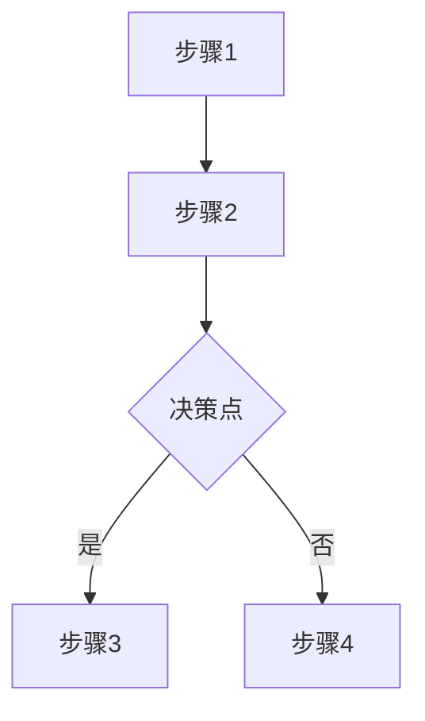
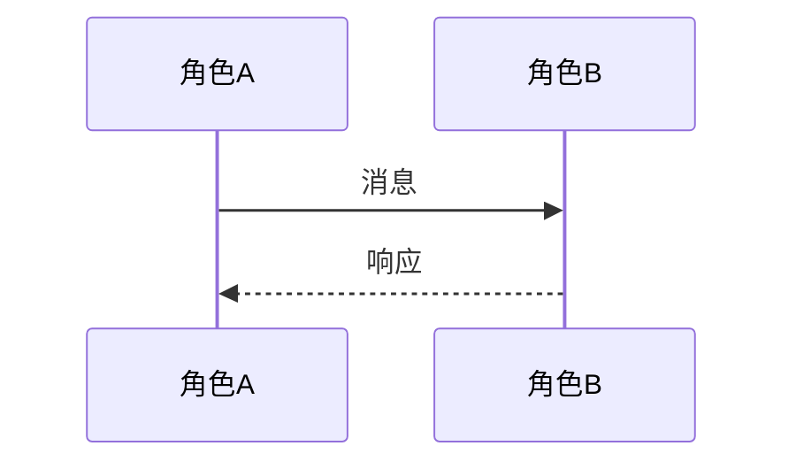

# 慧惠项目流程图设计说明

---

## 一、设计概述

本流程图文档基于原文章《慧惠项目角色揭秘》的内容，将原有的ASCII艺术画形式图表替换为专业的Mermaid流程图，旨在提升文档的专业性、可读性和可维护性。

---

## 二、设计思路

### 1. 视觉设计原则
- **清晰直观**：使用标准流程图符号（矩形、菱形、箭头等）
- **层次分明**：通过颜色和布局区分不同角色和阶段
- **色彩协调**：采用专业的渐变配色方案，符合专业文档规范
- **可编辑性**：使用Mermaid语法，便于未来更新维护

### 2. 色彩方案
| 颜色 | 用途 | 含义 |
|------|------|------|
| #667eea | 起始/核心步骤 | 重要节点 |
| #4ecdc4 | 审查/验证步骤 | 处理环节 |
| #ff6b6b | 决策节点 | 判断点 |
| #ffe66d | 调整步骤 | 修改环节 |
| #95e1d3 | 完成步骤 | 结束节点 |

### 3. 图表类型选择
- **流程图（Flowchart）**：展示单向流程步骤
- **序列图（Sequence Diagram）**：展示角色间的交互关系
- **关系图（Graph）**：展示职责分工和共同职责

---

## 三、图表与原文内容对应关系

### 图表1：规约定义者工作流程
**对应原文**：第三部分"角色一：规约定义者"的工作流程部分

**设计要点**：
- 展示从需求收集到交付验收的完整流程
- 包含决策节点（审查通过/不通过）
- 展示回退机制（审查不通过时重新调整需求）

### 图表2：系统建筑师工作流程
**对应原文**：第四部分"角色二：系统建筑师"的工作流程部分

**设计要点**：
- 展示从需求分析到部署上线的完整流程
- 突出安全审计作为最后一道防线
- 体现减法优先、外挂增强的设计原则

### 图表3：两大角色协作流程
**对应原文**：第五部分"两大角色的协作机制"

**设计要点**：
- 使用序列图展示角色间的交互关系
- 清晰展示信息流向（用户→规约定义者→系统建筑师）
- 包含分支逻辑（审查通过/不通过）

### 图表4：角色职责对比矩阵
**对应原文**：第五部分"关键协作点"表格

**设计要点**：
- 使用子图区分不同角色的职责
- 展示共同职责区域
- 用箭头表示职责间的关联关系

### 图表5：五大审查制度
**对应原文**：第六部分"五大审查制度"

**设计要点**：
- 展示审查的顺序流程
- 使用注释说明每个审查环节的重点
- 突出道境坐标系的四维评估

---

## 四、文件说明

### 文件清单
| 文件 | 说明 |
|------|------|
| 慧惠项目流程图.html | 包含所有专业流程图的HTML文件 |
| 慧惠项目角色揭秘.md | 更新后的原文，引用流程图文件 |
| 流程图设计说明.md | 本设计说明文档 |

### 使用方式
1. **查看流程图**：在浏览器中打开 `慧惠项目流程图.html`
2. **编辑流程图**：修改HTML文件中的Mermaid代码
3. **引用流程图**：Markdown文件中已添加链接引用

### 技术规格
- **图表引擎**：Mermaid v11.4.0
- **渲染方式**：客户端实时渲染
- **兼容性**：支持所有现代浏览器

---

## 五、更新维护指南

### 修改流程图
1. 打开 `慧惠项目流程图.html`
2. 找到对应图表的Mermaid代码块
3. 修改流程图内容（遵循Mermaid语法）
4. 保存并刷新浏览器查看效果

### 添加新图表
1. 在HTML文件中添加新的`chart-card`容器
2. 在容器中添加Mermaid代码块
3. 更新Markdown文件中的引用说明

### 版本控制
- 建议定期备份流程图文件
- 修改前记录版本号
- 重大变更时更新设计说明文档

---

## 六、附录：Mermaid语法参考

### 流程图基础语法

### 序列图基础语法

---

**文档版本**：v1.0  
**创建日期**：2026年6月  
**适用项目**：慧惠项目角色揭秘
